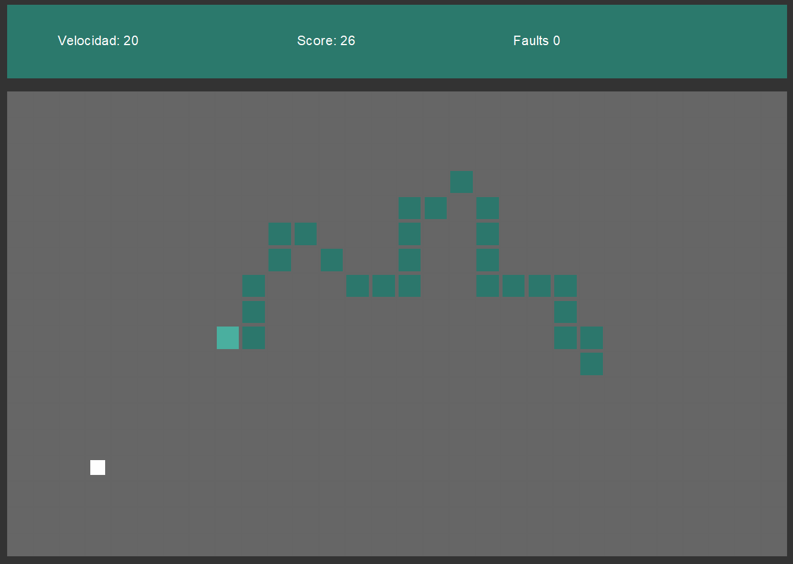
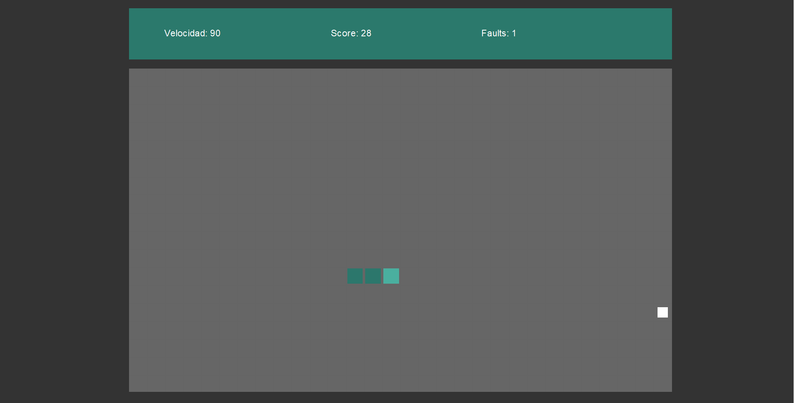

## SNAKE


  


This project is a version of the classic snake game, developed in Java. Control the snake, eat food and grow, but be careful not to crash into yourself! This project includes special features such as the use of parallel programming.

- ✨Interesting




## Technologies

Dillinger uses a number of open source projects to work properly:

- **Java JDK 21** - The programming language used to develop the game logic.
- **NetBeans IDE** - The integrated development environment (IDE) used to write, compile, and run the project.
- **Maven** - A build and dependency management tool used for project setup and organization.


## Installation

Download the project and compile it with the IDE mentioned above, or use the executable.


```sh
git clone https://github.com/Luis3Fernando/Snake
```



## Thank You for Checking Out This Project!

Thank you for taking the time to explore this Snake Game project! I hope you enjoy it as much as I enjoyed creating it. If you have any feedback, ideas, or suggestions, feel free to open an issue or contribute directly through a pull request.

Happy coding and have fun playing!
